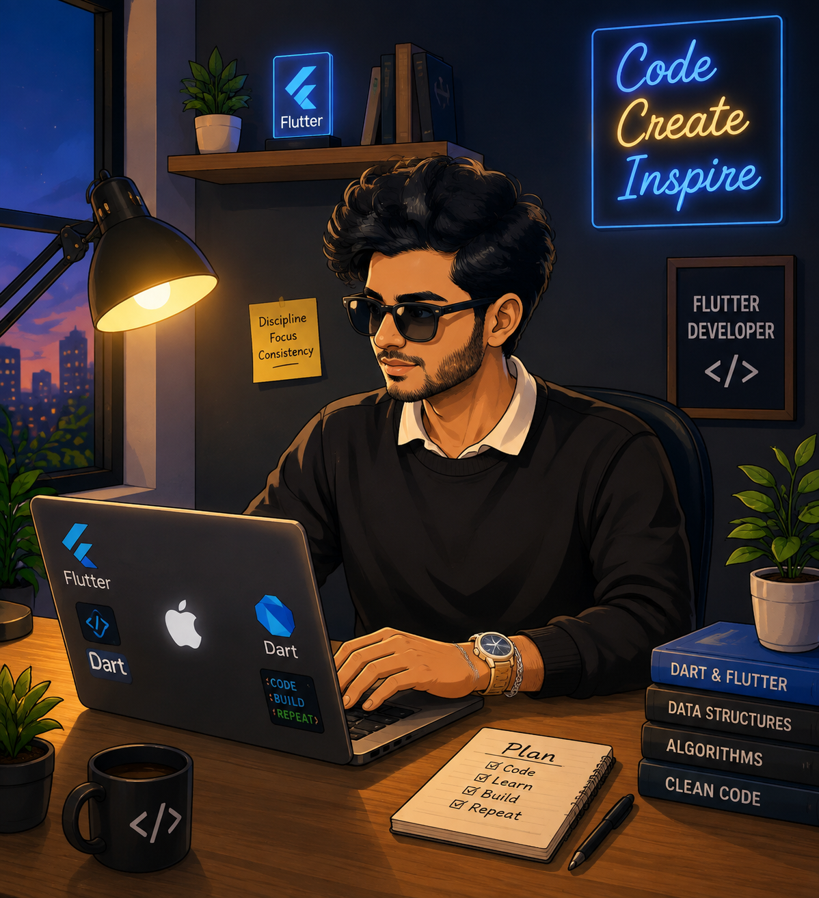
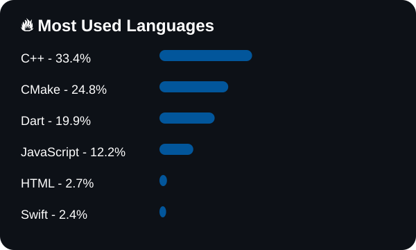

<h1 align="center">👋 Hi, I'm Amir Hossain Limon</h1>

<h3 align="center">
🚀 Flutter Developer | Mobile App Developer | CSE Student
</h3>


<p align="center">
  
</p>


<p align="center">

</p>


<p align="center">

</p>


---

## 🚀 About Me


```dart
class FlutterDeveloper {

  String name = "Amir Hossain Limon";

  String role = "Flutter Developer";

  List<String> skills = [
    "Flutter",
    "Dart",
    "Firebase",
    "REST API",
    "GetX",
    "Provider"
  ];

  String passion =
      "Building modern and scalable mobile applications";

}
```


# 🛠️ Tools & Technologies


<p align="center">


</p>


<p align="center">


</p>


---

# 📱 Flutter Projects


| Project | Description |
|---|---|
| 🚀 BMI Calculator | Flutter UI + Logic |
| 💬 Chat Application | Modern Chat UI |
| 📝 Flashcard Quiz App | Interactive Quiz App |
| 📖 Quote Vault | Quote Management App |
| ✈️ Travel UI | Responsive Flutter Design |
| 🛒 E-Commerce UI | Shopping App Design |


---

# 💻 Development Setup


```yaml
Mobile Development:
  - Flutter
  - Dart
  - Firebase
  - REST API

State Management:
  - GetX
  - Provider

IDE:
  - Android Studio
  - VS Code
  - CodeBlocks

Programming:
  - Java
  - C
  - C++

Tools:
  - Git
  - GitHub
  - Postman
  - Figma

Database:
  - MySQL
```


# 📊 GitHub Stats

<p align="center">


<br><br>


</p>

## 🔥 Most Used Languages

<p align="center">

</p>


# 🐍 Contribution Snake Animation


<p align="center">


</p>


---

# 🌐 Connect With Me


<p align="center">

<a href="https://github.com/Amirhossainlimon">


</a>


<a href="https://myportfolio-qj89.vercel.app/">


</a>

</p>


---

# 👀 Profile Views


<p align="center">


</p>


---

<h3 align="center">

⭐ Code • Create • Learn • Repeat ⭐

</h3>
